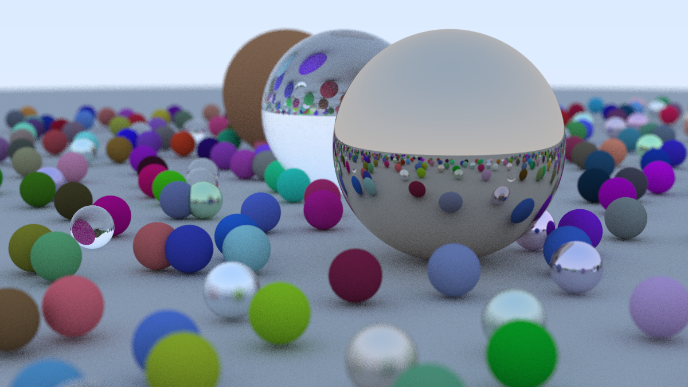

# Ray Tracing In One Weekend

[](./media/final_render.png)

This is a simple implementation of the ray tracing algorithm based on the book _Ray Tracing in One Weekend_ by Peter Shirley. The code is written in C++ and demonstrates the basic concepts of ray tracing, including geometry, lighting, and materials.

## Getting Started

To compile and run the code, you will need a C++ compiler that supports C++11 or later. You can use g++, clang++, or any other compatible compiler.

1. Clone the repository:

    ```bash
    git clone git@github.com:814nc0f14/ray-tracing-in-one-weekend.git
    ```

2. Navigate to the project directory:

    ```bash
    cd ray-tracing-in-one-weekend
    ```

3. Compile the code using your preferred compiler. E.g., with g++:

    ```
    g++ main.cpp -o ray_trancer.out -std=c++11
    ```

4. Run the compiled program:

    ```
    ./ray_trancer.out > output.ppm
    ```

This will generate an image file named `output.ppm` in the project directory. You can view this file using an image viewer that supports the PPM format.

